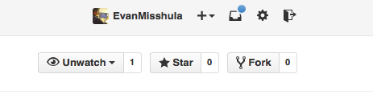
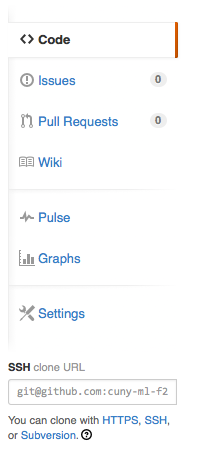

<h2>Table of Contents</h2>

<ul>
<li><a href="#sec-1">1. Introduction</a></li>
<li><a href="#sec-2">2. Set up your github account</a></li>
<li><a href="#sec-3">3. Mac and windows</a>
<ul>
<li><a href="#sec-3-1">3.1. Mac</a></li>
<li><a href="#sec-3-2">3.2. Windows</a></li>
</ul>
</li>
<li><a href="#sec-4">4. Configure git on your local machine [Don't skip]</a>
<ul>
<li><a href="#sec-4-1">4.1. On your machine open a terminal</a>
<ul>
<li><a href="#sec-4-1-1">4.1.1. Mac</a></li>
<li><a href="#sec-4-1-2">4.1.2. Windows</a></li>
</ul>
</li>
</ul>
</li>
<li><a href="#sec-5">5. Decide where to place your files</a>
<ul>
<li><a href="#sec-5-1">5.1. Mac OS X</a></li>
<li><a href="#sec-5-2">5.2. Windows</a></li>
</ul>
</li>
<li><a href="#sec-6">6. Set global git variables</a></li>
<li><a href="#sec-7">7. Clone the repository from your github account to your local machine</a></li>
<li><a href="#sec-8">8. Master vs. branch</a></li>
<li><a href="#sec-9">9. Switch branches</a></li>
<li><a href="#sec-10">10. Create a directory</a></li>
<li><a href="#sec-11">11. Copy your homework into that directory</a></li>
<li><a href="#sec-12">12. Add your homework to your branch</a></li>
<li><a href="#sec-13">13. Commit your local changes</a></li>
<li><a href="#sec-14">14. See everyone's changes</a>
<ul>
<li><a href="#sec-14-1">14.1. Configure an upstream master</a></li>
<li><a href="#sec-14-2">14.2. Sync the fork</a></li>
</ul>
</li>
<li><a href="#sec-15">15. Thanks</a></li>
</ul>

# Introduction

This is the repo for homework 1, the generation of a seemingly random data set.

This is the README file for homework #1.  Everyone is going to create
a fork of this repository and create a directory whose name is
<yourname> where your last name is separated from your first with an
underscore "\_".  Once you have done this copy the tab separated values
file (tsv) with your data to the file and send me a pull request from
your master to add it to the repo. If you have a team that consists of 
more than the person who has uploaded the file, please include a second
file called team.csv with the names of your team.

I will add tutorials over the next few days.

# Set up your github account

After you set up the github account and email me.  You will get a
github invite. Accept that invitation.  The next thing you should do is 
fork the repository.  That means that you create your own copy of the
repository in your github account.

You don't edit anything on github.  Github stores your backup.  In
order to edit your repo you have to copy it to your machine.  This requires you
to download git to your local machine.  There are several ways to do
this.

# Mac and windows

## Mac

You just need to go this link:

<http://git-scm.com/download/mac>

Double click on the downloaded file and install in the usual way.

## Windows

You just need to go this link:

<http://git-scm.com/download/win>

Double click on the downloaded file and install in the usual way.

# Configure git on your local machine [Don't skip]

## On your machine open a terminal

### Mac

Left click on launchbad (the icon with the rocket on it).  In the
search bar type terminal.  Left click the terminal and you are there.

### Windows

1.  Windows 8 and 8.1

    Right click on the Start button. This opens the power user menu.
    There is a shortcut for the terminal on that. Left click on it and you
    are there. Here is a larger article on this:
    
    <http://pcsupport.about.com/od/windows-8/a/command-prompt-windows-8.htm>

2.  Windows 7

    Click on the Start button. In the search box, type the following:
    
    `command` 
    
    Click on Command Prompt in the search results listing. Here is a
    larger reference.
    
    <http://pcsupport.about.com/od/windows7/a/command-prompt-windows-7.htm>

# Decide where to place your files

## Mac OS X

You documents are in /Users/<your name>/Documents.  In the terminal type:

`cd Documents`

To check where you are type:

`pwd`

This returns the present working directory.

## Windows

Your Documents are in C:\Users\\<your name>\Documents.  In the terminal type:

`cd Documents`

# Set global git variables

Tell Git your name so your commits will be properly labeled. Type
everything after the $ here:

`git config --global user.name "Your Name"`

Tell Git the email address that will be associated with your Git
commits. The email you specify should be the same one you used to sign
up for GitHub.

`git config --global user.email "YOUR EMAIL ADDRESS"`

# Clone the repository from your github account to your local machine

Now go back to your browser and open up the repo that you forked.  On the right side of 
the page near the top, there is a box under settings.  In that box is the URL of your fork.
Here is a picture.

Now that you know what you are looking for.  Copy it and clone it by typing:

`git clone git@github.com:<your_github_username>/homework1.git`

Now you have your own copy of the repo both on your machine and in your github account.
You can look at any of the files. 

# Master vs. branch

You actually have a copy of the master on your machine.  When you add something
for the first time, you should not add to the master you should make changes to 
your own branch. Usually the branch name is the topic.  In this case use your
first name.  Type:

`git branch <first_name>`

We can see all of the branches by typing:

`git branch`

The star means that we are still on the master branch.

# Switch branches

To switch branches type:

`git checkout <first_name>`

# Create a directory

Create a directory with your first and last name from the command line:

`mkdir <firstName_LastName>`

# Copy your homework into that directory

You can use the command line or a gui to copy your assignment into the directory you
just created. If you are on a team with more than one person, please include a file
with all of your team.

# Add your homework to your branch

To add your homework to your branch.  You will do this by adding all files in the directory
to your branch by typing:

`git add .`

# Commit your local changes

You should save or commit your changes with a message.  Type the following:

`git commit -m "added my homework."`

or type:

`git commit -m "added my homework and team."`

To update your copy on github you have to push your changes.  This only did the merge on the 
local side.

# See everyone's changes

## Configure an upstream master

Git does not automatically know where you want to pull from.
To see where git is pulling from, type:

`git remote -v`

The "-v" is a common command line flag for verbose.  Because you 
forked both the (fetch) where you pull from and where you push to
(push) are the same. Now specify a new upstream repository that will
be synced by the fork.

`git remote add upstream git://github.com/cuny-ml-f2014/homework1.git`

## Sync the fork

To see everyone's accepted changes to the master, you have to pull the upstream master. This 
requires a *fetch* command.  Make sure that you have commited your changes.  Type:

`git fetch upstream`

you have now pulled the changes from my branch to your local machine. The next step is to 
merge it into your master branch.

`git checkout master`

and to incorporate the changes on your local master, type:

`git merge upstream/master`

You will want to save those to your github account as well.  So to finish, type:

`git push origin master`

# Thanks